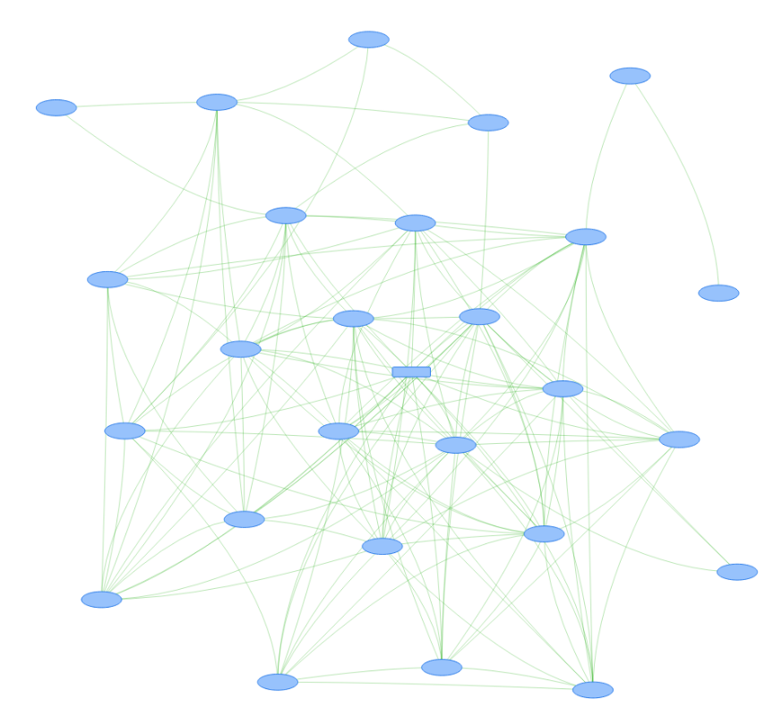
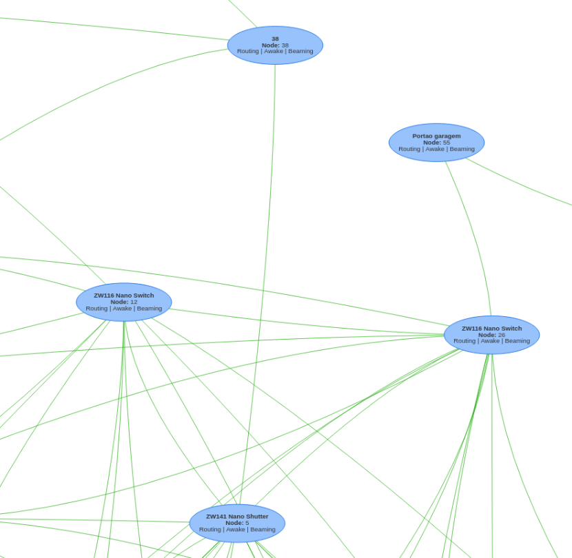

# OZW Network Visualization Card

Lovelace custom card for visualizing the ZWave network with the OpenZWave (beta) integration.

Requires that you are already using the [OpenZWave (beta)](https://www.home-assistant.io/integrations/ozw) integration commponent in Home Assistant.

ZWave network mapping can help you identify weak points like bad links between your devices.

# Installation Instructions

1. Put the [ozw-network-visualization-card.js](https://github.com/abmantis/ozw-network-visualization-card/blob/master/ozw-network-visualization-card.js) lovelace card into the `[config]/www/ozw-network-vizualization-card directory` ether by copying it there or by using the file editor to create it with a cut and paste of the content.
2. Add the lovelace resource with `Configuration ¦ Lovelace Dashboards ¦ Resources ¦ ⊕ ¦ URL:/local/ozw-network-visualization-card.js` & `Resource Type JavaScript Module ¦ Update`.
3. Add custom card (works best in panel mode) through `Overview ¦ ⋮ ¦ Configure UI ¦ New Tab + ¦ Give it a Title and any other options` & `select Panel Mode`. Open this new view which will be empty, at the bottom right click the + for cards window. Choose the manual card type and a card configuration window will open, this is where you will add type: `custom:ozw-network-visualization-card`. Save and exit UI configurator

New map card should be there.

# Note on node's connections

Currently, there is no information about the quality of the connection between two nodes, so all connections are represented in green.

# Screenshots

